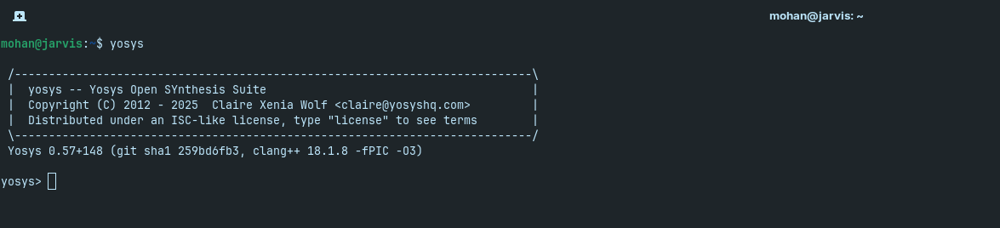

# 🚀 Week 0: VLSI System Design (VSD) Program Foundation & Tool Setup  

**VLSI Week Status**  

Welcome to my **VLSI System Design (VSD) Program** repository!  
This week, I focused on **setting up the development environment** and installing the essential open-source tools used in RTL design, simulation, and synthesis.  

---

## 🎯 System & Virtual Machine Configuration  

| Specification 💻 | Details 📋 |
|------------------|------------|
| Operating System 🐧 | Ubuntu 20.04+ |
| RAM 💾 | 6 GB |
| Storage 💿 | 50 GB HDD |
| vCPUs ⚡ | 4 |

💡 *This setup ensures smooth toolchain operation and efficient simulations.*  

---

## ⚙️ Tool Installation & Verification  

The following tools were installed for RTL synthesis, simulation, waveform visualization, and layout design:  

---

# Install Yosys on Linux

This guide shows how to install **Yosys** using the **OSS CAD Suite** on Zorin OS (Ubuntu-based).  
The OSS CAD Suite provides the latest Yosys along with other FPGA tools.

---

## 1. Download OSS CAD Suite
Go to the [OSS CAD Suite Releases](https://github.com/YosysHQ/oss-cad-suite-build/releases) page.  

Download the latest:


---

## 2. Extract the Archive
  Open a terminal and run (replace `yyyy-mm-dd` with the actual date in the filename):
  ```bash
   cd ~/Downloads
  tar -xvzf oss-cad-suite-linux-x64-yyyy-mm-dd.tgz -C ~/ 
  ```
  This will create a folder like:
  ```bash
  ~/oss-cad-suite
  ```
---
## 3. Set Up the Environment
  Permanent (recommended)

  Edit your ~/.bashrc (or ~/.zshrc if you use Zsh):
   ```bash
    gedit ~/.bashrc
   ```

  Add this line at the bottom of the gedit file and save the file  :
  ```bash
    export PATH="$HOME/oss-cad-suite/bin:$PATH"
  ```


  Then cancel the gedit file and command on terminal:
  ```bash
    source ~/.bashrc
  ```
---
## 4. Verify Installation

   Run:
   ```bash
   yosys -V
   ```

  You should see something like:
  ```bash
   Yosys 0.57+148 (git sha1 259bd6fb3, clang++ 18.1.8 -fPIC -O3)
  ```

  If you run:
  ```bash
  yosys
  ```
  You should see something like :
      

---
