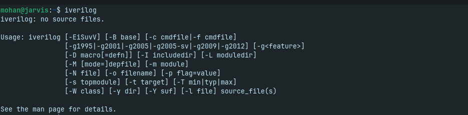

# 🚀 Week 0: VLSI System Design (VSD) Program Foundation & Tool Setup  

**VLSI Week Status**  

Welcome to my **VLSI System Design (VSD) Program** repository!  
This week, I focused on **setting up the development environment** and installing the essential open-source tools used in RTL design, simulation, and synthesis.  

---

## 🎯 System configuration 
## System Information:

| **Component**     | **Details**                                   |
|--------------------|-----------------------------------------------|
| Hardware Model     | HP HP Laptop 15s-du1xxx                      |
| Memory             | 8.0 GiB                                      |
| Processor          | Intel® Core™ i3-10110U CPU @ 2.10GHz × 4     |
| Graphics           | Mesa Intel® UHD Graphics (CML GT2)           |
| Disk Capacity      | 1.0 TB                                       |
| OS Name            | Zorin OS 17.3 Core                           |
| OS Type            | 64-bit                                       |
| Windowing System   | Wayland                                      |

💡 *This setup ensures smooth toolchain operation and efficient simulations.*  

---

## ⚙️ Tool Installation & Verification  

The following tools were installed for RTL synthesis, simulation, waveform visualization, and layout design:  

---

 # 🧠 Install Yosys on Linux

This guide shows how to install **Yosys** using the **OSS CAD Suite** on Zorin OS (Ubuntu-based).  
The OSS CAD Suite provides the latest Yosys along with other FPGA tools.

---

## 1. Download OSS CAD Suite
Go to the [OSS CAD Suite Releases](https://github.com/YosysHQ/oss-cad-suite-build/releases) page.  

Download the latest:


---

## 2. Extract the Archive
  Open a terminal and run :
  ```bash
   cd ~/Downloads
tar -xvzf oss-cad-suite-linux-x64-*.tgz -C ~/

  ```
  This will create a folder like:
  ```bash
  ~/oss-cad-suite
  ```
---
## 3. Set Up the Environment
  Permanent (recommended)

  Edit your ~/.bashrc (or ~/.zshrc if you use Zsh):
   ```bash
    gedit ~/.bashrc
   ```

  Add this line at the bottom of the gedit file and save the file  :
  ```bash
    export PATH="$HOME/oss-cad-suite/bin:$PATH"
  ```


  Then cancel the gedit file and command on terminal:
  ```bash
    source ~/.bashrc
  ```
---
## 4. Verify Installation

   Run:
   ```bash
   yosys -V
   ```

  You should see something like:
  ```bash
   Yosys 0.57+148 (git sha1 259bd6fb3, clang++ 18.1.8 -fPIC -O3)
  ```

  If you run:
  ```bash
  yosys
  ```
  You should see something like :
      

---

 # 🧠 Iverilog Installation:
 
 Iverilog is included with the OSS-CAD Suite, but the issue is that it ships with the latest version 13, which is not considered stable according to   Iverilog’s documentation.
 To resolve this, we need to manually roll back to a stable release. This can be done by removing all Iverilog files that come bundled with the OSS-CAD Suite (using the search function can make this easier).
 
 installation:
 
 Run:
 ```bash
   sudo apt update
   sudo apt install iverilog
  ```
 Verify Installation:

 Run:
 ```bash
   iverilog
  ```
You should see something like :

 
 
 Run :
 
 ```bash
   iverilog -v
  ```
You should see something like :

.png)
 
 # 🧠 GTKWAVE Installation:
 
 GTKWave is also included in the OSS-CAD Suite, but in this case it comes with version 3.4.0, which is stable.
 However, to be on the safe side, it is recommended to remove the GTKWave files located inside the OSS-CAD Suite directory.
 
installation: 

Run :
```bash
  sudo apt update
sudo apt install gtkwave
```
Verify Installation:

Run:
```bash
  gtkwave
```
You should see something like :


---
